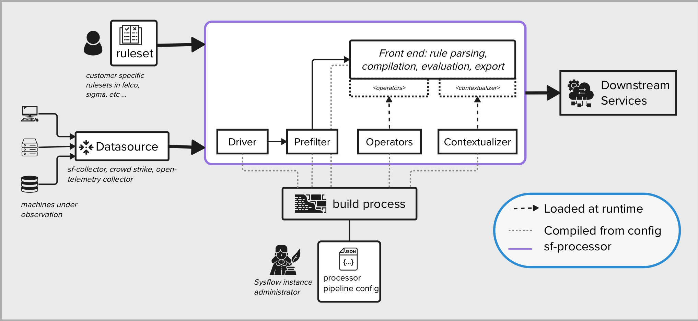

# Creating New Data Sources for the Policy Engine
---
The processor's policy engine has been split into a frontend (i.e., rule parser, compiler, and rule evaluator), and a backend (i.e., a specific data format for a data source). This was done so that users can reuse the policy engine with various datasets without having to rewrite large swaths of the policy engine to do so. The rearchitecture also enables us to more easily support new policy languages such as sigma or yara.

Note, that new data formats are only currently supported at processor compile time. This improves performance by not using runtime interfaces for data events but instead uses golang generics which allows developers to reuse the policyengine code on different data objects, simply by specifying the object. The developer's responsibility is to create the appropriate objects which implement the required interfaces. In this document, we will go through the interfaces to implement, and describe how to compile a new data format into the processor.

The diagram below provides a basic overview of the end-to-end architecture. Let's start with a quick overview that outlines the scenario we're addressing.

1) A specific ruleset designed to capture specific behavior is developed by the customer. Imagine a security engineer or something similar
2) A telemetry datasource sends records of a defined format to the processor which can be evaluated by the ruleset
3) A config file specifying the pipeline that should be used to run the processor (datasource, rules engine etc.) is provided at startup and the appropriate runtime configuration is built.
4) After events are evaluated by the rulesengine an exporter can alert downstream services.

The driver, prefilter, operators, and contextualizer are the interfaces that must be implemented for a new datasource to be supported.



1) **Driver** -- responsible for converting the raw data from the datasource to a format that can be evaluated by the rules engine.
2) **Prefilter** -- to increase performance you can ignore (prefilter) some events that don't need to be evaluated by the rules engine.
3) **Operators** -- all supported rulesets can be evaluated with only a few operators. This interface specifies the implementation of these operators for the given datasource.
4) **Contextualizer** -- after rules have been evaluated if you want to add additional metadata for use by the downstream services.

### Datasource Definition

To use leverage multiple backend data types we define some core datatypes in the [policyengine](https://github.com/sysflow-telemetry/sf-processor/tree/go1.19-sigma/core/policyengine) module, and then using golang type aliasing and build-tagging to swap in different data sources at compile time.  The policy engine only supports a single data source per compilation.

It works as follows.  First, the developer builds out their operations, prefilter, and contextualizer objects, (described below) and places them under the `core/policyengine/source/<data source name>` directory.  For example, if you were building a data source for sysmon, you would put it under: `core/policyengine/source/sysmon/`.   

Next, the developer is going to create a types file inside `core/policyengine/source/common` called `types_<data source name>.go` (e.g., `types_sysmon.go`).   An example SysFlow types file is [here](https://github.com/sysflow-telemetry/sf-processor/blob/go1.19-sigma/core/policyengine/source/common/types_flatrecord.go).  This file must define all the following variables, and point them to your implementation:

```
//go:build flatrecord
// +build flatrecord
// Package source implements a backend for policy compilers.
package common
import (
	"github.com/sysflow-telemetry/sf-processor/core/flattener"
	"github.com/sysflow-telemetry/sf-processor/core/policyengine/source/flatrecord"
)
// Record is the record associated with the data source (backend) that will
// be used with the rules compiler.  The policy engine is defined
// with a "common.Record" type.  We use type aliasing to swap in
// different data sources currently. We will support multipe sources
// in the future. All types defined here are specific to the SysFlow flatrecord backend.
type Record = flatrecord.Record
// Channel is the backend specific channel wrapper object used to send data
// to the policy engine
type Channel = flattener.FlatChannel
// NewOperations specifies a constructor for the backend specific operations
// object used with the policy engine
var NewOperations = flatrecord.NewOperations
// NewPrefilter specifies a constructor for the backend specific prefilter
// object used with the policy engine
var NewPrefilter = flatrecord.NewPrefilter
// NewContextualizer specifies a constructor for the backend specific contextualizer
// object used with the policy engine
var NewContextualizer = flatrecord.NewContextualizer
```

The file must also specify a build tag at the top representing the data source.  For example for a sysmon data source, the build tag might be:
```
//go:build sysmon
// +build sysmon
```

Similarly, the developer must also add another file to the `core/policyengine/` directory called `policyengine_<data source name>.go`.  This file provides two data source specific function implementations that support data transformations if necessary.  A sample file for SysFlow is [here](https://github.com/sysflow-telemetry/sf-processor/blob/go1.19-sigma/core/policyengine/policyengine_flatrecord.go)

```
//go:build flatrecord
// +build flatrecord
// Package policyengine implements a plugin for a rules engine for telemetry records.
package policyengine
import (
	"github.com/sysflow-telemetry/sf-apis/go/sfgo"
	"github.com/sysflow-telemetry/sf-processor/core/policyengine/source/flatrecord"
)
// bypassPolicyEngine passes a record onto the exporter if there is no policy engine available.
// note any record transformations can be done here.
func (s *PolicyEngine) bypassPolicyEngine(rec *sfgo.FlatRecord) {
	s.out(flatrecord.NewRecord(rec))
}
// processAsync processes a record in the policy engine.
// note any record transformations can be done here.
func (s *PolicyEngine) processAsync(rec *sfgo.FlatRecord) {
	s.pi.ProcessAsync(flatrecord.NewRecord(rec))
}
```

Again, note the build flags at the top of the file.  Finally, change the GOBUILDFLAG tag in the [Makefile](https://github.com/sysflow-telemetry/sf-processor/blob/df56e6ad33f88c2d35861a8935155deaf1ea0d96/Makefile#L15) to point to your build tag rather than "flatrecord".  If everything is configured properly, you should be able to build.  Remember you must configure a driver and connect it to the policy engine.

## Required Backend Implementation Definitions

### The Operations Interface
The operations interface defines the mechanisms by which the frontend rulesengine evaluates records from the backend datasource. This interface is called by the frontend at policy compilation time, and returns a set of functions that are called on each data record during policy engine runtime. The operations interface is defined [here](https://github.com/sysflow-telemetry/sf-processor/blob/go1.19-sigma/core/policyengine/source/operations.go).  Currently, it defines five operations:


*	`Exists(attr string) (policy.Criterion[R], error)` -  creates a criterion for an existential predicate.
*   `Compare(lattr string, rattr string, op Operator) (policy.Criterion[R], error)` - creates a criterion for a binary predicate.
* `FoldAny(attr string, list []string, op Operator) (policy.Criterion[R], error)` - creates a disjunctive criterion for a binary predicate over a list of strings.
*   `FoldAll(attr string, list []string, op Operator) (policy.Criterion[R], error)` - creates a conjunctive criterion for a binary predicate over a list of strings.
*   `RegExp(attr string, re string) (policy.Criterion[R], error)` - creates a criterion for a regular-expression predicate.

Note that `lattr` and `rattr` represent the left and right attributes of an operation.  They can either represent an attribute of the data source being processed, or a literal value that is compared to the other attribute using an operator.   For example, the statement:  `sf.proc.name = cat`, would have a `lattr` as `sf.proc.name`, which would be mapped to the an attribute in the underlying data object (in this case a SysFlow object), `cat`,  which is a literal to be compared with `sf.proc.name` using an operator `=`.  This type of operation would be passed to the `Compare` function in the operations interface.

`Compare`, `FoldAny`, and `FoldAll` take an operator enumeration as seen [here](https://github.com/sysflow-telemetry/sf-processor/blob/df56e6ad33f88c2d35861a8935155deaf1ea0d96/core/policyengine/source/operators.go#L31).  Operators can be things like: =, <=, >=, <, >, or `contains`, `startswith`, `endswith`, etc., and are dependent on the language used in the frontend.  

Each operation (e.g., Compare, Exists, FoldAny, etc.) returns a generic `policy.Criterion[R]`  [object](https://github.com/sysflow-telemetry/sf-processor/blob/go1.19-sigma/core/policyengine/policy/predicates.go#L29).  The `Criterion` object contains a predicate function that, given a data source record object, knows how to evaluate an operation against an instance of the data source record.   For example, going back to our initial example: `sf.proc.name = cat`.  At policy compile time, the language frontend would call the function with the following parameters: 

`Compare("sf.proc.name", "cat", =)`

An implementation for the Compare function, could look as follows (see flatrecord [implementation](https://github.com/sysflow-telemetry/sf-processor/tree/go1.19-sigma/core/policyengine/source/flatrecord) for the full implementation of the sysflow backend using a flattened (normalized) record). 

```
// Compare creates a criterion for a binary predicate.
func (op *Operations) Compare(lattr string, rattr string, operator source.Operator) (policy.Criterion[*Record], error) {
	switch operator {
	case source.Lt, source.LEq, source.Gt, source.GEq:
		return op.compareInt(lattr, rattr, operator)
	}
	return op.compareStr(lattr, rattr, operator)
}
// compareStr creates a criterion for a binary predicate over strings.
func (op *Operations) compareStr(lattr string, rattr string, operator source.Operator) (policy.Criterion[*Record], error) {
	ml := Mapper.MapStr(lattr)
	mr := Mapper.MapStr(rattr)
	o, _ := op.strOps.OpFunc(operator)
	p := func(r *Record) bool { return o(ml(r), mr(r)) }
	return policy.Criterion[*Record]{Pred: p}, nil
}
// compareInt creates a criterion for a binary predicate over integers.
func (op *Operations) compareInt(lattr string, rattr string, operator source.Operator) (policy.Criterion[*Record], error) {
	ml := Mapper.MapInt(lattr)
	mr := Mapper.MapInt(rattr)
	o, _ := op.intOps.OpFunc(operator)
	p := func(r *Record) bool { return o(ml(r), mr(r)) }
	return policy.Criterion[*Record]{Pred: p}, nil
}
```

The `Compare` function for SysFlow, breaks out the operation by data type: integer, or string, but tries to map the `lattr`, and `rattr` to attributes within the data source using a set of [mapping functions](https://github.com/sysflow-telemetry/sf-processor/blob/go1.19-sigma/core/policyengine/source/flatrecord/fieldmapper.go).  The mapping functions are designed to extract field values out of a `Record`, and a boolean predicate function is ultimately returned by the `Compare` function, which will be called on each `Record` during runtime.   The predicate function looks as follows:

```
func(r *Record) bool { return o(ml(r), mr(r)) }
```

The developer does not have to use a mapper function paradigm for their implementation, but we found this model to help simplify mapping attributes during runtime with some datasources.

## Contextualizer Interface

The Contextualizer [interface](https://github.com/sysflow-telemetry/sf-processor/blob/go1.19-sigma/core/policyengine/source/contextualizer.go) provides a standardized api for adding labels or modifying a record based on the rules that are triggered by it. If you don't need to modify the data source, feel free to use the default contextualizer defined in the same file as the interface.  An example of a contextualizer for the SysFlow data source is [here](https://github.com/sysflow-telemetry/sf-processor/blob/go1.19-sigma/core/policyengine/source/flatrecord/contextualizer.go). 


## Prefilter Interface

The Prefilter [interface](https://github.com/sysflow-telemetry/sf-processor/blob/go1.19-sigma/core/policyengine/source/prefilter.go) is designed to allow developers to bypass certain rules based on a prefilter criteria.  For example, in the Falco-based rule language we use with SysFlow, a rule can have a [prefilter](https://sysflow.readthedocs.io/en/latest/processor.html#policy-language) attribute based on event type such that rules are only applied to certain event types. For Sigma, the prefilter is `logsource`.  An example of a Prefilter implementation for the SysFlow data source is [here](https://github.com/sysflow-telemetry/sf-processor/blob/go1.19-sigma/core/policyengine/source/flatrecord/prefilter.go). 


## Driver

A Driver is a special type of [plugin](https://sysflow.readthedocs.io/en/latest/processor.html#plugins) that parses incoming data from a particular data source such as a socket, file, or kafka queue, and forwards it on to a [processor plugin](https://sysflow.readthedocs.io/en/latest/processor.html#processor-plugins) such as the policy engine [plugin](https://github.com/sysflow-telemetry/sf-processor/blob/go1.19-sigma/core/policyengine/policyengine.go).  A [driver interface](https://github.com/sysflow-telemetry/sf-apis/blob/master/go/plugins/driver.go) looks as follows:

* `Init(pipeline SFPipeline, config map[string]interface{}) error` - takes a pipeline object with context about the broader processor pipeline, as well as a driver configuration map that can hold custom configurations for the driver.  The configuration is stored in the driver [section](https://github.com/sysflow-telemetry/sf-processor/blob/df56e6ad33f88c2d35861a8935155deaf1ea0d96/resources/pipelines/pipeline.distribution.json#L4) of the  `pipeline.json` file. 
* `Run(path string, running *bool) error` - takes a data source path, or URL from the processor command line, as well as a "running" boolean, which is true as long as the driver is still meant to collect data.  This variable should be checked periodically and shutdown when false.
* `GetName() string` - returns a unique name for the driver.  
* `Register(pc SFPluginCache)` - [registers](https://github.com/sysflow-telemetry/sf-processor/blob/df56e6ad33f88c2d35861a8935155deaf1ea0d96/driver/sysflow/filedriver.go#L84) the driver and driver channel with the plugin cache.  This is called by the processor, and must add the driver to the cache. 
* Cleanup() -  clean up method for when the driver is shutdown. 

Note, driver's can be specified in two ways in the process. First, is from the [command line](https://sysflow.readthedocs.io/en/latest/processor.html#usage) using the `-driver` flag with a name (e.g., `sysmon`) as long as all the information can be passed to the driver through the `path` parameter on the command line.  `path` can be used to pass in a URL, file, database string, etc.  For more complex driver configurations or multi-driver setup, a developer can also put configurations directly in the pipeline.json file, using the `drivers` section as follows:

```
{
	"drivers" : [
		{
			"driver": "name", ....
		},
	]
}
```

Note that the pipeline.json must have a `driver` name that corresponds with the name registered with the pipeline. 


Example SysFlow File Reader driver [here](https://github.com/sysflow-telemetry/sf-processor/blob/go1.19-sigma/driver/sysflow/filedriver.go)

Example SysFlow Socket Reader driver [here](https://github.com/sysflow-telemetry/sf-processor/blob/go1.19-sigma/driver/sysflow/streamingdriver.go)